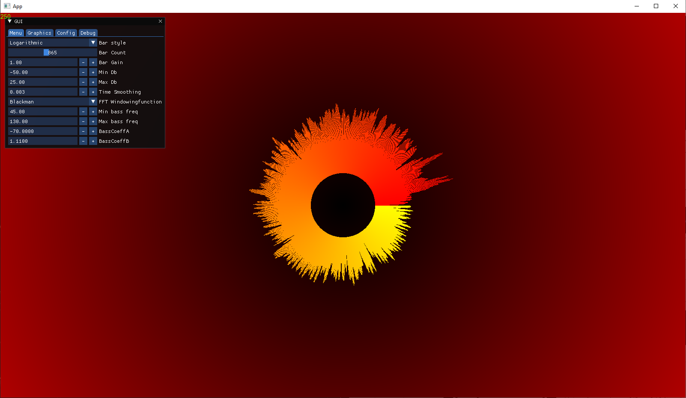
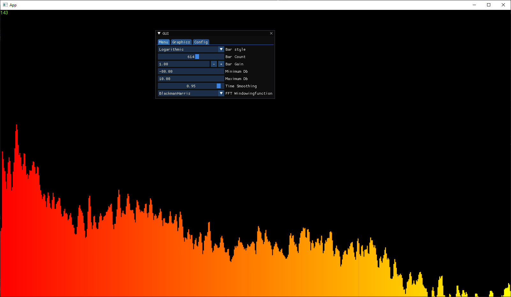
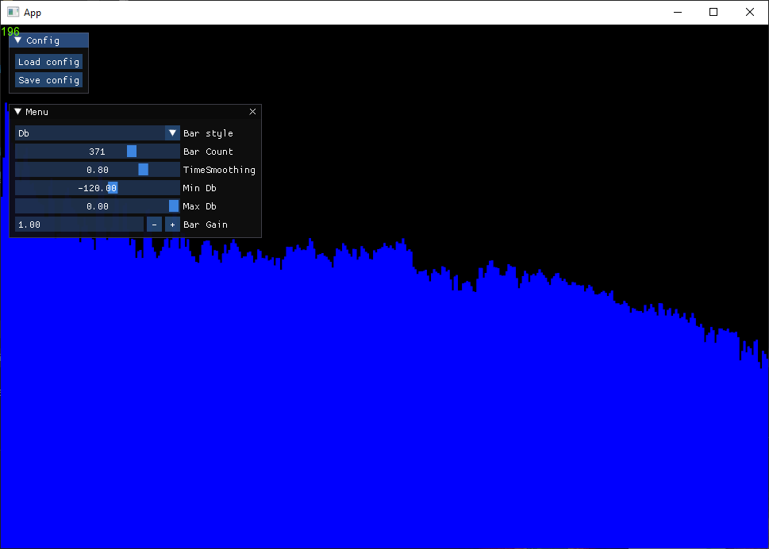
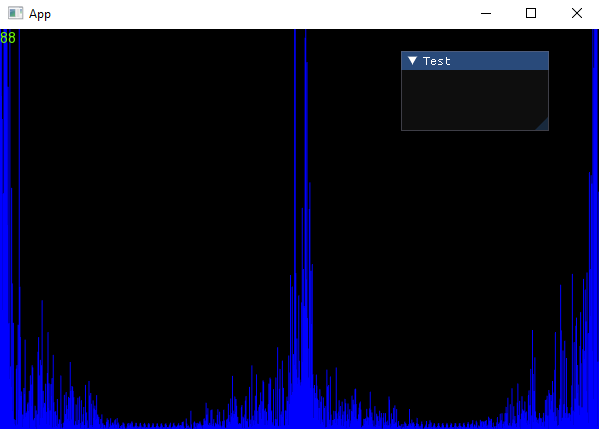

# Spektrum

Audiovisualizer using ffts and other soundprocessing, computer audio is captured using wasapi and loopbacks to capture all audio on current desktop. Audio processing is done with help of fftw3. Visualization is done with sfml and there is also a gui made with imgui.

To use, download dependencies using vcpkg. following packages are used and required to build:

```
vcpkg.exe install fftw3 imgui-sfml sfml thor boost-circular-buffer
```

This project is still in early development and more features are to come. Here is a preview of current version.

This is a recreation of an old project of mine. The old project was implemented in html and js, have a [look](https://h3rl-firstapp.web.app/soundvisualizer/) if you want.

## Version gallery


v0.04 - 30.05.2023
<hr>


v0.03 - 21.05.2023
<hr>


v0.02 - 09.05.2023
<hr>


v0.01 - 08.05.2023
<hr>